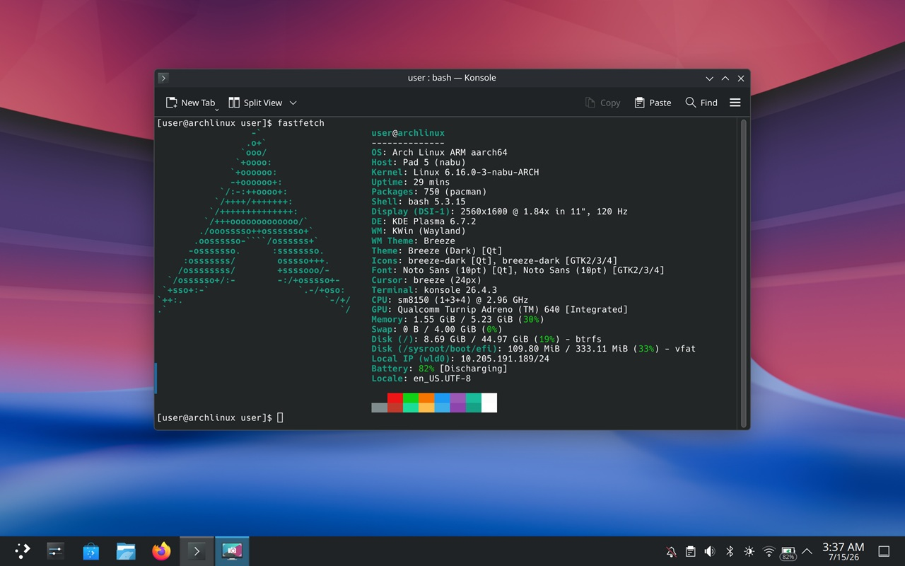

# Arch Linux ARM Installer for Xiaomi Pad 5 (nabu)


---

## Overview

Arch Linux ARM with **bootc** (ostree-based) updates for the Xiaomi Pad 5 (Snapdragon 860). Supports dual/triple-boot with Android/Windows via DBKP (DualBoot Kernel Patcher) and UEFI.

**Features:**
- Btrfs root filesystem with snapper snapshots
- Unified Kernel Image (UKI) with rEFInd boot manager
- OTA updates via `bootc upgrade --apply`
- Plasma Desktop and GNOME variants
- zram swap with zstd compression
- Flatpak + Flathub pre-configured for sandboxed apps
- Distrobox pre-installed for containerized CLI/dev tools

---

## Requirements

- Xiaomi Pad 5 (nabu)
- Unlocked bootloader
- [TWRP](https://github.com/Kumar-Jy/twrp_device_xiaomi_nabu/releases/tag/mod-hybrid) custom recovery
- Installer zip from [Releases](https://github.com/Kumar-Jy/Nabu-arch-images/releases)

---

## Partition Layout

The installer expects the following GPT partitions (already present from a Windows/dual-boot setup):

| Partition | Block Device | Format | Purpose |
|-----------|-------------|--------|---------|
| `boot` | `/dev/block/bootdevice/by-name/boot` | Android boot | Patched with DBKP + UEFI payload |
| `esp` | `/dev/block/by-name/esp` | FAT32 | EFI System Partition (rEFInd, UKI, Windows EFI) |
| `win` | `/dev/block/by-name/win` | NTFS | Windows installation |
| `linux` | `/dev/block/by-name/linux` | Btrfs (preferred) or ext4 | Arch Linux rootfs |

The Btrfs `linux` partition uses a single `@` subvolume as the default root, with `/home` → `/var/home` as a symlink (ostree layout).

---

## Installation

### Creating Partitions (if not already present)

If your device doesn't have the required `esp` and `linux` partitions, create them first:

1. **Boot into TWRP** from your PC:
   ```bash
   fastboot boot twrp.img
   ```

2. **Open TWRP Terminal**:
   - In TWRP, go to **Advanced > Terminal**

3. **Run the partition tool**:
   ```bash
   partition
   ```
   Follow the on-screen instructions to create the `win` (optional), `linux` and `esp` partitions.

4. **Reboot back into TWRP** after partitioning:
   - Go to **Reboot > Recovery**

5. Proceed to the installation steps below.

### Triple Boot (Windows + Android + Linux)

For triple boot with Windows, Android, and Linux:

1. **Install Windows first** — Set up Windows on the `win` partition
2. **Return to Android** — Boot back into Android to ensure it's working
3. **Flash the Linux installer** — Boot into TWRP and flash the Arch Linux installer zip
5. **Reboot** — rEFInd will show all three boot options (Windows, Android, Linux)


### Arch-linux Install (Single Boot or Dual Boot)

1. **Download** the latest installer artifact from [Releases](https://github.com/Kumar-Jy/Nabu-arch-images/releases):
   - `Nabu-alarm-bootc-plasma-installer.zip` — Plasma Desktop
   - `Nabu-alarm-bootc-gnome-installer.zip` — GNOME Desktop

2. **Boot into TWRP**:
   - Power off the tablet
   - Hold **Power + Volume Up** to enter TWRP

3. **Flash the installer zip**:
   - In TWRP, tap **Install**
   - Navigate to the downloaded zip (on USB OTG, SD card, or internal storage)
   - Swipe to confirm flash

4. **What the installer does**:
   - Formats `/dev/block/by-name/linux` with Btrfs
   - Extracts the rootfs image onto the partition
   - Patches the `boot` partition with DBKP + UEFI payload
   - Sets up ESP with rEFInd and the Unified Kernel Image

5. **Reboot**:
   - Select **Reboot > System**
   - The first boot attempts to resize the filesystem to fill the partition automatically. If it doesn't expand, run manually:
     ```bash
     sudo btrfs filesystem resize max /
     ```

6. **Default credentials**: `user` / `123456`

### Dual/triple Boot with Android/Windows

The installer supports dual/triple-boot with android/Windows via DBKP:

- The `boot` partition is patched with DualBootKernelPatcher + UEFI payload
- On first UEFI boot, `installer/install.bat` runs in WinPE to reconfigure Windows BCD
- rEFInd provides a boot menu to choose between Android, Arch Linux and Windows
- If Secure Boot is detected, ESP is reformatted and WinPE reconfigures Windows automatically

---

## Post-Install Setup

### First Boot

```bash
# Change default password
passwd user

# Check bootc is working
bootc status
```

### bootc (Image-based Updates)

The system uses **bootc** for atomic, image-based OS updates. The entire root filesystem is delivered as a container image via ostree. Updates download a new image and create a new deployment — the old one is preserved for rollback.

```bash
# Check current deployment info
bootc status

# Fetch an update (stages for next boot)
bootc upgrade

# Fetch + download + stage update immediately
bootc upgrade --apply

# Apply a staged update without reboot
bootc upgrade --apply --ram-only

# Reboot into the new deployment
sudo bootc reboot

# Roll back to the previous deployment
sudo bootc rollback
```

> `bootc-fetch-apply-updates.service` runs on a timer to automatically check and stage updates.

### Package Management

> **Important:** On a bootc system, the rootfs comes from a container image. Packages installed via `pacman -S` on the live system will **not survive** a `bootc upgrade` because the upgrade replaces the entire deployment.

#### Flatpak (Recommended for GUI apps)

Flatpak is pre-configured with Flathub. Install sandboxed apps that persist across bootc upgrades:

```bash
# Install a GUI app
flatpak install flathub org.mozilla.firefox
flatpak install flathub org.gimp.GIMP

# Run an app
flatpak run org.mozilla.firefox

# List installed apps
flatpak list

# Update all flatpak apps
flatpak update

# Remove an app
flatpak uninstall org.gimp.GIMP
```

Flatpak apps are stored in `~/.local/share/flatpak` (on `/var`), which is **persistent across bootc upgrades**.

#### Distrobox (Recommended for CLI/dev tools)

Distrobox is pre-installed. It creates OCI containers with full systemd support, shared home directory, and GPU access:

```bash
# Create an Arch Linux container
distrobox create --name arch --image archlinux:latest

# Enter the container
distrobox enter arch

# Inside the container — install anything with pacman
sudo pacman -S neovim gcc docker
exit

# Export a CLI tool from container to host
distrobox-export --app neovim

# Export a GUI app (appears in desktop app menu)
distrobox-export --app firefox

# List containers
distrobox list

# Stop a container
distrobox stop arch

# Remove a container
distrobox rm arch
```

Distrobox containers are stored in `~/.local/share/distrobox/` (on `/var`), which is **persistent across bootc upgrades**.

#### Native pacman (Temporary — survives until next bootc upgrade)

> ⚠️ **Warning:** This modifies the ostree deployment overlay. Changes **will be lost** on the next `bootc upgrade`. Do NOT use this for critical packages — use flatpak or distrobox instead.

```bash
# Enable temporary write access to /usr
sudo bootc usr-overlay

# Install packages
sudo pacman -S neovim htop

# Packages are gone after next bootc upgrade
```

#### Custom Container Image (Persistent across upgrades)

Build a custom container image with your desired packages baked in, then switch to it:

```bash
# Create a Containerfile that layers packages on top of the base
cat > Containerfile << 'EOF'
FROM ghcr.io/kumar-jy/nabu-plasma:latest
RUN pacman -Syu --noconfirm neovim htop
EOF

# Build the custom image
podman build -t my-custom-image .

# Push to a registry (optional, for portability)
podman push my-custom-image ghcr.io/your-user/nabu-custom:latest

# Switch the system to use the new image
sudo bootc switch ghcr.io/your-user/nabu-custom:latest
sudo reboot
```

#### Ad-hoc packages (live only)

For testing or temporary tools that don't need to survive an upgrade:

```bash
sudo pacman -S neovim htop
```

These are installed into the current deployment's overlay. They will be present until the next `bootc upgrade`.

#### AUR / User Repo Packages

```bash
# Install an AUR helper
sudo pacman -S --needed base-devel git
git clone https://aur.archlinux.org/yay.git
cd yay && makepkg -si

# Install AUR packages (survives until next bootc upgrade)
yay -S some-aur-package
```

### Kernel Updates

The kernel is delivered as part of the container image (`linux-nabu` package). When a new kernel is available:

```bash
bootc upgrade --apply
sudo reboot
```

On boot, `nabu-uki-sync.service` automatically regenerates the Unified Kernel Image (UKI) for the new kernel version. The rEFInd boot menu will pick it up automatically.

### Managing Deployments

```bash
# List all deployments with their status
bootc status

# Pin a deployment to prevent it from being garbage-collected
sudo ostree admin pin 0

# Remove old deployments (keep only the latest N)
sudo ostree admin cleanup --keep=3

# Show available container image references
bootc status | grep image
```

### Btrfs Snapshots (User Data)

Snapper snapshots cover the `/home` directory — not the OS itself (OS rollback is handled by bootc):

```bash
# List snapshots
sudo snapper list

# Create a manual snapshot
sudo snapper create -d "before dangerous operation"

# Restore a snapshot
sudo snapper -c root undochange 5..0

# Check snapshot disk usage
sudo snapper -c root status 5..0
```

> ⚠️ **Do not use `snapper rollback`** — it is incompatible with ostree. Use `bootc rollback` for OS rollbacks instead.

### System Maintenance

```bash
# Update any ad-hoc packages (live overlay only)
sudo pacman -Syu

# Clean package cache
sudo pacman -Scc

# Check Btrfs health
sudo btrfs scrub start /
sudo btrfs filesystem df /

# Balance Btrfs free space
sudo btrfs balance start -dusage=50 /

# Check and repair Btrfs filesystem (run from recovery)
sudo btrfs check /dev/block/by-name/linux

# Check current bootc deployment details
bootc status

# View system logs
journalctl -xe
```

---

## Container Images

Pre-built container images are available on GHCR:

| Image | Description |
|-------|-------------|
| `ghcr.io/kumar-jy/nabu-base:latest` | Base Arch Linux ARM system |
| `ghcr.io/kumar-jy/nabu-plasma:latest` | Base + Plasma Desktop |
| `ghcr.io/kumar-jy/nabu-gnome:latest` | Base + GNOME Desktop |

### Using bootc with Container Images

```bash
# Switch to a different image (e.g., from base to Plasma)
sudo bootc switch ghcr.io/kumar-jy/nabu-plasma:latest

# Reboot to apply
sudo reboot
```

---

## Building from Source

### Prerequisites

- Docker or Podman
- ARM64 runner (or QEMU user-static for cross-compilation)

### Build the Base Image

```bash
podman build -t nabu-base -f base/Containerfile base/
```

### Build Desktop Images

```bash
# Plasma
podman build -t nabu-plasma \
  --build-arg BASE_IMAGE=nabu-base:latest \
  -f plasma/Containerfile plasma/

# GNOME
podman build -t nabu-gnome \
  --build-arg BASE_IMAGE=nabu-base:latest \
  -f gnome/Containerfile gnome/
```

### Build Installer Zip

Use the GitHub Actions workflow (`build-arch-installer.yml`) to build the full installer artifacts, or manually export a container to a Btrfs image and package it with the `META-INF/`, `bin/`, `DBKP/`, and `installer/` directories.

---

## Troubleshooting

### Boot loops or no boot

- Reboot to TWRP
- Re-flash the installer zip
- Check that the `linux` partition exists and is formatted

### WiFi not working

```bash
sudo systemctl enable --now NetworkManager
nmcli device wifi list
nmcli device wifi connect <SSID> password <password>
```

### Sound not working

```bash
# Check audio devices
arecord -l
aplay -l

# Load UCM config for nabu
sudo alsaucm list
```

### Bootc update fails

```bash
# Check bootc status
bootc status

# Force pull new image
bootc upgrade
sudo reboot
```

---

## Credit & Thanks

| Component | Description | Author |
| :--- | :--- | :--- |
| Arch-Installer | Arch Installer script | [Kumar-Jy](https://github.com/Kumar-Jy) |
| RootFS & EFI | Arch RootFS and kernel | [Kumar-Jy](https://github.com/Kumar-Jy), [rodriguest](https://github.com/rodriguezst) [Timofey](https://github.com/timoxa0) |
| DBKP/ | DualBoot kernel patcher and UEFI payload | [rodriguest](https://github.com/rodriguezst), [remtrik](https://github.com/remtrik), [map220v](https://github.com/map220v), [Project Aloha](https://github.com/Project-Aloha) |

## See Also

- [postmarketOS](https://wiki.postmarketos.org/wiki/Xiaomi_Pad_5_%28xiaomi-nabu%29) — pmOS for nabu
- [pocketblue](https://github.com/pocketblue/pocketblue) — Fedora Silverblue for nabu
- [nabu-fedora](https://github.com/jhuang6451/nabu_fedora) — Fedora for nabu
- [nabu-alarm](https://github.com/nabu-alarm/) — Arch Linux ARM for nabu (EOL)
- [Xiaomi-Nabu](https://github.com/TheMojoMan/Xiaomi-Nabu) — Ubuntu for nabu
