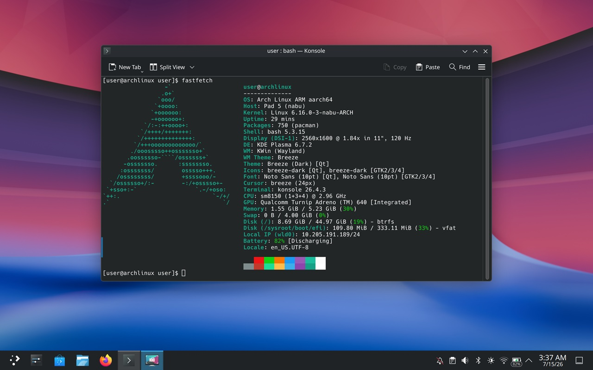

# Arch Linux ARM Installer for Xiaomi Pad 5 (nabu)


---

## Requirements

- Xiaomi Pad 5 (nabu)
- Unlocked bootloader
- [TWRP](https://github.com/Kumar-Jy/twrp_device_xiaomi_nabu/releases/tag/mod-hybrid) custom recovery
- Installer zip from [Releases](https://github.com/Kumar-Jy/Nabu-arch-images/releases)

---

## Partition Layout

The installer expects the following GPT partitions (already present from a Windows/dual-boot setup):

| Partition | Block Device | Format | Purpose |
|-----------|-------------|--------|---------|
| `boot` | `/dev/block/bootdevice/by-name/boot` | Android boot | Patched with DBKP + UEFI payload |
| `esp` | `/dev/block/by-name/esp` | FAT32 | EFI System Partition (rEFInd, UKI, Windows EFI) |
| `win` | `/dev/block/by-name/win` | NTFS | Windows installation |
| `linux` | `/dev/block/by-name/linux` | ext4 | Arch Linux rootfs |

---

## Installation

### Creating Partitions (if not already present)

If your device doesn't have the required `esp` and `linux` partitions, create them first:

1. **Boot into TWRP** from your PC:
   ```bash
   fastboot boot twrp.img
   ```

2. **Open TWRP Terminal**: In TWRP, go to **Advanced > Terminal**

3. **Run the partition tool**:
   ```bash
   partition
   ```
   Follow the on-screen instructions to create the `win` (optional), `linux` and `esp` partitions.

4. **Reboot back into TWRP** after partitioning: Go to **Reboot > Recovery**

5. Proceed to the installation steps below.

### Triple Boot (Windows + Android + Linux)

1. **Install Windows first** — Set up Windows on the `win` partition
2. **Return to Android** — Boot back into Android to ensure it's working
3. **Flash the Linux installer** — Boot into TWRP and flash the Arch Linux installer zip
4. **Reboot** — rEFInd will show all three boot options (Windows, Android, Linux)

### Arch Linux Install (Single Boot or Dual Boot)

1. **Download** the latest installer from [Releases](https://github.com/Kumar-Jy/Nabu-arch-images/releases):
   - `arch-nabu-installer-plasma.zip` — Plasma Desktop
   - `arch-nabu-installer-gnome.zip` — GNOME Desktop

2. **Boot into TWRP**: Power off the tablet, hold **Power + Volume Up**

3. **Flash the installer zip**: In TWRP, tap **Install**, navigate to the zip, swipe to confirm

4. **What the installer does**:
   - Formats `/dev/block/by-name/linux` with ext4
   - Extracts the rootfs image onto the partition
   - Patches the `boot` partition with DBKP + UEFI payload
   - Sets up ESP with rEFInd and the Unified Kernel Image

5. **Reboot**: Select **Reboot > System**

6. **Default credentials**: `user` / `123456`

### Dual/Triple Boot with Android/Windows

- The `boot` partition is patched with DualBootKernelPatcher + UEFI payload
- On first UEFI boot, `installer/install.bat` runs in WinPE to reconfigure Windows BCD
- rEFInd provides a boot menu to choose between Android, Arch Linux and Windows

---

## Troubleshooting

For issues with the Wi-Fi MAC, booting, or kernel/UKI updates, see
[TROUBLESHOOTING.md](TROUBLESHOOTING.md).

---

## Updating the Kernel

### Official update (from the nabu repository)

```bash
sudo pacman -Syu
```

The `linux-nabu` package ships an mkinitcpio preset and an install scriptlet, so the
UKI (`/boot/efi/EFI/arch/arch-linux-nabu.efi`) is rebuilt automatically on every
kernel install/upgrade. A device-side pacman hook (`90-linux-nabu.uki.hook` →
`/usr/libexec/nabu/uki-regenerate`) acts as the fallback: it refreshes the preset
to the newest installed kernel and rebuilds, and repairs the UKI if the preset is
ever missing or stale.

### Local / custom (non-official) kernel update

If you built your own kernel package:

```bash
# 1. Build your own package (bump pkgver / pkgrel on EVERY build!)
makepkg
# 2. Install it directly
sudo pacman -U linux-nabu-<version>-aarch64.pkg.tar.xz
```

> pacman decides "is this an update?" using only `pkgver`/`pkgrel`, never the kernel
> version string. If those don't change, pacman reports *"up to date"* and skips the
> install, so the UKI won't be regenerated. Always bump `pkgver` (or `pkgrel`) for
> each new build.

If your package ships the preset + install scriptlet (like the official `PKGBUILD`),
the UKI regenerates automatically. If you built it from a **different** PKGBUILD
(no preset/scriptlet), regenerate manually with the fallback:

```bash
sudo /usr/libexec/nabu/uki-regenerate
```

Or, if the script is unavailable, do it by hand:

```bash
kernver=$(ls /usr/lib/modules/ | sort -V | tail -1)
sudo tee /etc/mkinitcpio.d/linux-nabu.preset > /dev/null << EOF
ALL_config="/etc/mkinitcpio.conf"
ALL_kver="/boot/vmlinuz-${kernver}"
PRESETS=('default')
default_uki="/boot/efi/EFI/arch/arch-linux-nabu.efi"
default_cmdline="/etc/cmdline.d/root.conf"
EOF
sudo sed -i "s|^DeviceTree=.*|DeviceTree=/boot/dtb-${kernver}|" /usr/lib/kernel/uki.conf
sudo mkinitcpio -P
```

Verify the UKI was produced:

```bash
findmnt /boot/efi
ls -l /boot/efi/EFI/arch/
```

---

## Credit & Thanks

| Component | Description | Author |
| :--- | :--- | :--- |
| Arch-Installer | Arch Installer script | [Kumar-Jy](https://github.com/Kumar-Jy) |
| RootFS & EFI | Arch RootFS and kernel | [Kumar-Jy](https://github.com/Kumar-Jy), [rodriguest](https://github.com/rodriguezst), [Timofey](https://github.com/timoxa0) |
| DBKP | DualBoot kernel patcher and UEFI payload | [rodriguest](https://github.com/rodriguezst), [remtrik](https://github.com/remtrik), [map220v](https://github.com/map220v), [Project Aloha](https://github.com/Project-Aloha) |

## See Also

- [postmarketOS](https://wiki.postmarketos.org/wiki/Xiaomi_Pad_5_%28xiaomi-nabu%29) — pmOS for nabu
- [pocketblue](https://github.com/pocketblue/pocketblue) — Fedora Silverblue for nabu
- [nabu-fedora](https://github.com/jhuang6451/nabu_fedora) — Fedora for nabu
- [nabu-alarm](https://github.com/nabu-alarm/) — Arch Linux ARM for nabu (EOL)
- [Xiaomi-Nabu](https://github.com/TheMojoMan/Xiaomi-Nabu) — Ubuntu for nabu
